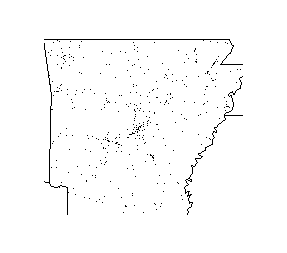

This is a small test package that includes 5 functions.

Functions
---------

The five functions are developed to processing a certain type of
datasets, which can be obtained
[here](https://d3c33hcgiwev3.cloudfront.net/_e1adac2a5f05192dc8780f3944feec13_fars_data.zip?Expires=1614988800&Signature=dhHXO0~db2p4MbHHQAfUAZTsuWnZScw46nFJ3SBb6eqcxU9P1oGOl6WuMxrc28FL6~GSbCpwvDAYqO72QrBg67k5zExcXynCC6V1sdesnnD9QltlEgW5QuBbkPwE063IaYct~TUecxvaEOZ0c0izOWq62fvELVKcL8gDuHLn5B0_&Key-Pair-Id=APKAJLTNE6QMUY6HBC5A).

### Read .csv.bz2 into data.frame

**`fars_read`**

This is a function that reads the .csv file in a compressed file into a
data.frame in R. The parameter includes `filename`, a character string
giving the name of the compressed file. The function returns a
data.frame containing the data in the .csv file. Note: the directory of
the file should be the same as the working directory. Otherwise the
function will stop with an error.

**Example:**

    tb <- fars_read("accident_2013.csv")
    head(tb)

gives

    # A tibble: 6 x 50
      STATE ST_CASE VE_TOTAL VE_FORMS PVH_INVL  PEDS PERNOTMVIT PERMVIT PERSONS COUNTY  CITY   DAY
      <dbl>   <dbl>    <dbl>    <dbl>    <dbl> <dbl>      <dbl>   <dbl>   <dbl>  <dbl> <dbl> <dbl>
    1     1   10001        1        1        0     0          0       8       8    115     0     6
    2     1   10002        2        2        0     0          0       2       2     55  1670     3
    3     1   10003        1        1        0     0          0       1       1     89  1730     6
    4     1   10004        1        1        0     0          0       3       3     73   350     6
    5     1   10005        2        2        0     0          0       3       3    125  3050     6
    6     1   10006        2        2        0     0          0       3       3     97  2100     8
    # ... with 38 more variables: MONTH <dbl>, YEAR <dbl>, DAY_WEEK <dbl>, HOUR <dbl>,
    #   MINUTE <dbl>, NHS <dbl>, ROAD_FNC <dbl>, ROUTE <dbl>, TWAY_ID <chr>, TWAY_ID2 <chr>,
    #   MILEPT <dbl>, LATITUDE <dbl>, LONGITUD <dbl>, SP_JUR <dbl>, HARM_EV <dbl>, MAN_COLL <dbl>,
    #   RELJCT1 <dbl>, RELJCT2 <dbl>, TYP_INT <dbl>, WRK_ZONE <dbl>, REL_ROAD <dbl>,
    #   LGT_COND <dbl>, WEATHER1 <dbl>, WEATHER2 <dbl>, WEATHER <dbl>, SCH_BUS <dbl>, RAIL <chr>,
    #   NOT_HOUR <dbl>, NOT_MIN <dbl>, ARR_HOUR <dbl>, ARR_MIN <dbl>, HOSP_HR <dbl>,
    #   HOSP_MN <dbl>, CF1 <dbl>, CF2 <dbl>, CF3 <dbl>, FATALS <dbl>, DRUNK_DR <dbl>

### Standardized Filename Based on a Specific Year

**`make_filename`**

This is function that makes a standardized filename based on a specific
year. For example, with input 2021, the output will be a character
string "accident\_2021.csv.bz2". The parameter includes `year`, an
integer specifying a year. The function returns a character string with
the format "accident\_%(year).csv.bz2".

**Example:**

    make_filename(1990)

gives

    [1] "accident_1990.csv.bz2"

### Fetch 'Year' and 'Month' of the Records

**`fars_read_years`**

This is a function that fetches the 'year' and 'MONTH' columns of the
records of regarding fatal injuries, in the specific given years. The
parameter includes `years`, a numeric vector that specifying the years
of interest. The function returns a list, each element of which is a
data.frame containing the corresponding 'year' and 'MONTH' columns.
Note: ff a file for a year does not exist in the working directory, the
return value will be NULL with a warning message.

**Example 1:**

    fars_read_years(c(2013,2014,2015))

gives

    [[1]]
    # A tibble: 30,202 x 2
       MONTH  year
       <dbl> <dbl>
     1     1  2013
     2     1  2013
     3     1  2013
     4     1  2013
     5     1  2013
     6     1  2013
     7     1  2013
     8     1  2013
     9     1  2013
    10     1  2013
    # ... with 30,192 more rows

    [[2]]
    # A tibble: 30,056 x 2
       MONTH  year
       <dbl> <dbl>
     1     1  2014
     2     1  2014
     3     1  2014
     4     1  2014
     5     1  2014
     6     1  2014
     7     1  2014
     8     1  2014
     9     1  2014
    10     1  2014
    # ... with 30,046 more rows

    [[3]]
    # A tibble: 32,166 x 2
       MONTH  year
       <dbl> <dbl>
     1     1  2015
     2     1  2015
     3     1  2015
     4     1  2015
     5     1  2015
     6     1  2015
     7     1  2015
     8     1  2015
     9     1  2015
    10     1  2015
    # ... with 32,156 more rows

**Example 2: **

    fars_read_years(c(2013,2016))

gives

    [[1]]
    # A tibble: 30,202 x 2
       MONTH  year
       <dbl> <dbl>
     1     1  2013
     2     1  2013
     3     1  2013
     4     1  2013
     5     1  2013
     6     1  2013
     7     1  2013
     8     1  2013
     9     1  2013
    10     1  2013
    # ... with 30,192 more rows

    [[2]]
    NULL

    Warning message:
    In value[[3L]](cond) : invalid year: 2016

### fars\_summarize\_year

**`fars_summarize_year`**

This is a function that Summarize the counts of fatal injuries for each
month, given specific years. The parameter includes `years`, a numeric
vector that specifying the years of interest. The function returns a
data.frame with 12 rows and `length(years)` columns, each row of which
represents a month, and each column represents a year. Note: If a file
for a year does not exist in the working directory, the returned
data.frame will not contain the corresponding column, with a warning
message.

**Example 1:**

    fars_summarize_years(c(2013,2014))

gives

    # A tibble: 12 x 3
       MONTH `2013` `2014`
       <dbl>  <int>  <int>
     1     1   2230   2168
     2     2   1952   1893
     3     3   2356   2245
     4     4   2300   2308
     5     5   2532   2596
     6     6   2692   2583
     7     7   2660   2696
     8     8   2899   2800
     9     9   2741   2618
    10    10   2768   2831
    11    11   2615   2714
    12    12   2457   2604

**Example 2:**

    fars_summarize_years(c(2013,2015))

gives

    # A tibble: 12 x 3
       MONTH `2013` `2015`
       <dbl>  <int>  <int>
     1     1   2230   2368
     2     2   1952   1968
     3     3   2356   2385
     4     4   2300   2430
     5     5   2532   2847
     6     6   2692   2765
     7     7   2660   2998
     8     8   2899   3016
     9     9   2741   2865
    10    10   2768   3019
    11    11   2615   2724
    12    12   2457   2781

### The Map of Records in a State

**`fars_map_state`**

This is a function that draws the map of the given state, and the
records are shown on the map as dots according to their locations. The
parameters include `state.num`, a character string or a integer giving
the state number, and `year`, an integer specifying a year. The
functions returns a map featuring the boundary of the state based on the
records, the state, and also the recoreds as dots inside the state.

Note: 1. the function will stop with an error. 2. If the input state.num
does not match any record, the function will stop with the error
"invalid STATE number". 3. If no records match the given year and state,
the function will stop with the message "no accidents to plot".

**Example 1:**

    fars_map_state(5, 2014)

gives

**Example 2:**

    fars_map_state(3, 2013)

gives

    Error in fars_map_state(3, 2013) : invalid STATE number: 3
